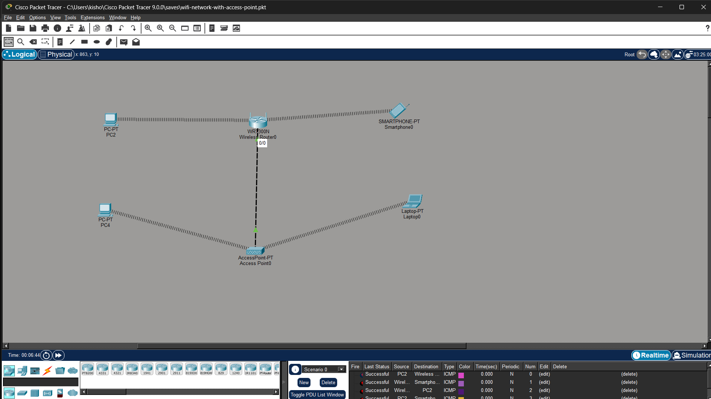

# 📶 CCNA Wireless Network Lab

## 📌 Overview

This project demonstrates the implementation of a Wireless Local Area Network (WLAN) using a wireless router and access point in Cisco Packet Tracer. It enables wireless communication between multiple devices such as PCs, laptops, and smartphones within a network.

---

## 🎯 Objectives

* Configure a wireless router and access point
* Enable wireless connectivity for multiple devices
* Assign IP addresses using DHCP
* Ensure communication between wired and wireless devices
* Test network connectivity

---

## 🧩 Key Features

* Wireless LAN (WLAN) setup
* Integration of wired and wireless devices
* DHCP-based IP address assignment
* Multi-device connectivity (PC, Laptop, Smartphone)
* Basic network configuration and testing

---

## 🛠️ Tools Used

* Cisco Packet Tracer
* Networking fundamentals

---

## 🌐 Network Topology



---

## ⚙️ Configuration (Sample)

### 🔹 Wireless Router Setup

```id="9nfuwv"
enable
configure terminal

interface g0/0
ip address 192.168.1.1 255.255.255.0
no shutdown
```

---

### 🔹 DHCP Configuration

```id="9r8r2e"
ip dhcp pool WLAN
network 192.168.1.0 255.255.255.0
default-router 192.168.1.1
dns-server 8.8.8.8
```

---

### 🔹 Wireless Settings

* SSID: **MyWiFi**
* Security: **WPA2-PSK**
* Password: **password123**

---

## 📂 Project Structure

ccna-wireless-network-lab/
│── topology/
│── configs/
│── README.md

---

## 📊 Verification

* Connect devices to WiFi network
* Check IP address using DHCP
* Ping between devices

```id="9nm5yh"
ping 192.168.1.1
```

---

## 📊 Learning Outcomes

* Understanding wireless networking concepts
* Configuring WLAN in Packet Tracer
* DHCP and IP management
* Connectivity troubleshooting

---

## 📢 Conclusion

This project demonstrates how wireless networks are configured and managed, enabling seamless communication between multiple devices in a WLAN environment.
